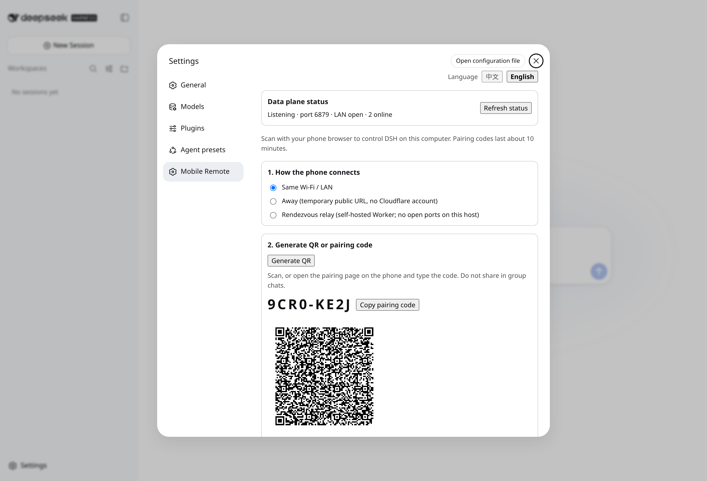
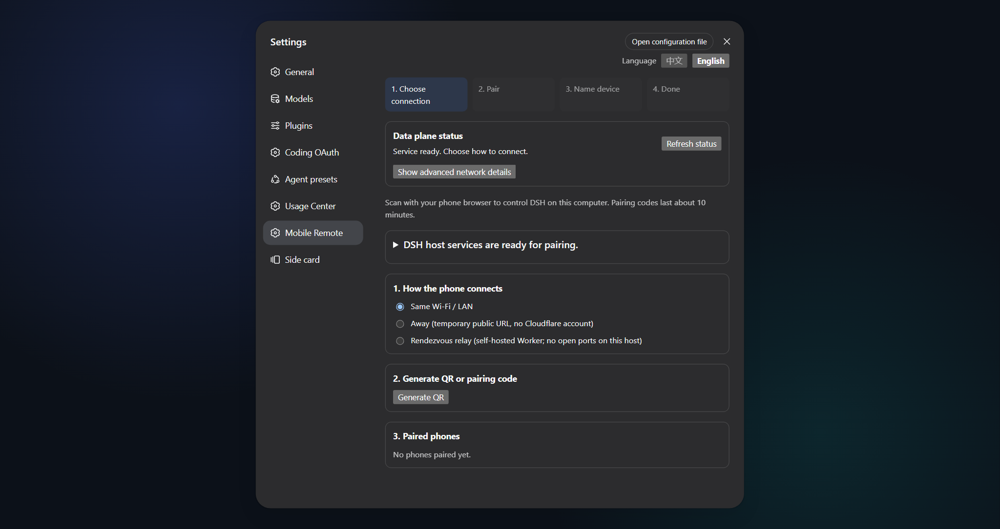
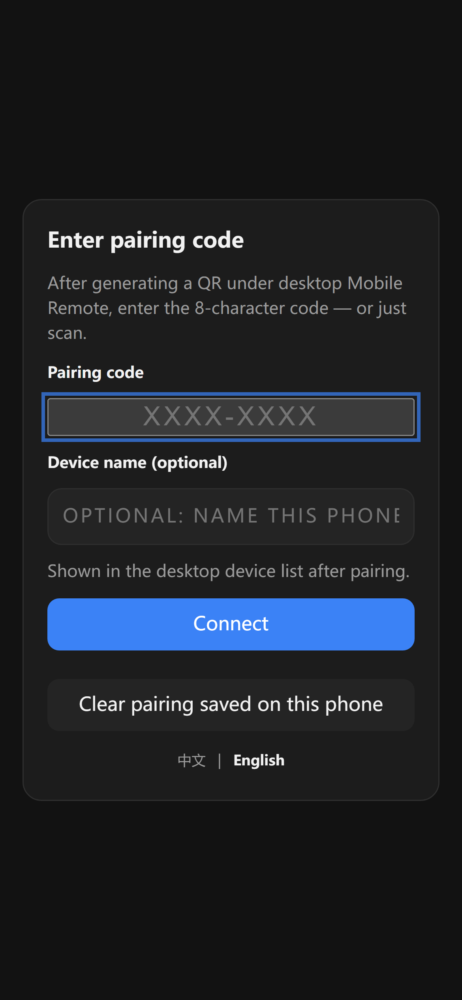
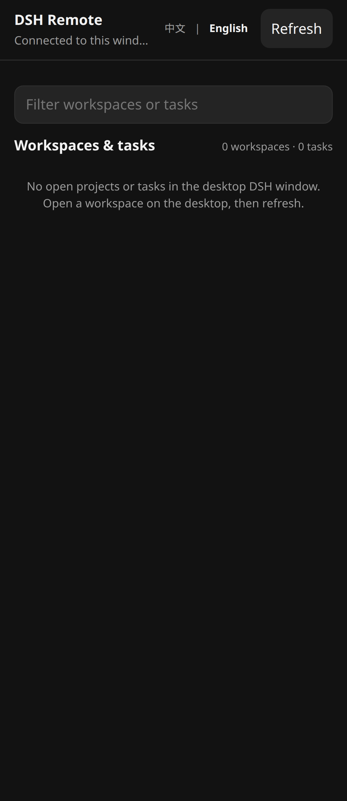

<!-- banner -->
<div align="center">

# dsh-coding-remote-kit

**v0.5.1** · DeepSeek Harness `0.1.1-rc.2` · GitHub `dsh-coding-remote-kit`

**Удалённый доступ с телефона к [DeepSeek Harness](https://github.com/deepseek-ai/dsh).** Сопрягите телефон с компьютером, где уже работает `dsh web`, наблюдайте сессии и выполняйте узкий набор записей — не открывая полный Web API.

[](https://www.npmjs.com/package/dsh-coding-remote-kit)
[](LICENSE)
[](CONTRIBUTING.md)

*[English](README.md) · [中文版](README.zh-CN.md) · [日本語](README.ja.md) · [한국어](README.ko.md) · [Português (BR)](README.pt-BR.md) · [Español](README.es.md) · [Français](README.fr.md) · [Deutsch](README.de.md) · [Русский](README.ru.md)*

</div>

---

> **Upgrade / 升级：** Follow the versioned steps in [`INSTALL.md`](INSTALL.md). Install into the existing `web` profile, keep profile/config/credential files, and restart one existing DSH Web process after all packages are updated. When Hub and Subscription are both used, `dsh-coding-oauth-core@0.1.0` is their shared npm dependency, not a separate DSH plugin.

---

Сообщественный плагин. **Не связан с DeepSeek и не одобрен DeepSeek.** Замысел продукта ближе к [Orca Mobile Companion](https://www.onorca.dev/docs/mobile), чем ко второй копии настольной IDE.

Перед правками в этом репозитории прочитайте [`AGENTS.md`](AGENTS.md): **не перезапускайте производственный `dsh-web` самостоятельно.** Подготовьте tarball; перезапуск делает оператор.

## Имена

Сначала разрабатывался как GitHub `dsh-mobile-remote`. npm-имя **`dsh-mobile-remote` — другой проект** (плагин удалённого управления WeChat). Этот плагин публикуется как `dsh-coding-remote-kit`.

| | Используйте это | Примечания |
|---|---|---|
| npm | `dsh-coding-remote-kit@0.5.1` | `dsh plugin --profile web add dsh-coding-remote-kit@0.5.1` |
| GitHub | [`lninghaha/dsh-coding-remote-kit`](https://github.com/lninghaha/dsh-coding-remote-kit) | прежнее имя checkout `dsh-mobile-remote` |
| id плагина Cordis | `mobile-remote` | без изменений |
| HTTP страницы настроек | `/api/mobile-remote/*` | без изменений |
| Хранилище | `$DSH_HOME/storages/mobile-remote/` | без изменений |

**Не** выполняйте `dsh plugin add dsh-mobile-remote` — это установит чужой WeChat-плагин.

## Статус

| Этап | Статус |
| --- | --- |
| Исследование (Orca / экосистема DSH) | готово — [`docs/research/`](docs/research/) |
| M1 скелет плагина + ADR / модель угроз | готово |
| M2 сопряжение / LAN-плоскость данных | готово |
| M3 узкий RPC / согласования | готово |
| M4 подписанный HTTPS / нативное приложение | не начато |
| M5 самостоятельно размещённый rendezvous Worker | готово — [`docs/05-cloud-relay.md`](docs/05-cloud-relay.md) |

## Возможности

- **Двуязычный UI** — китайский и английский в настройках рабочего стола и companion на телефоне (`?lang=` / переключатель в приложении; по умолчанию `navigator.language`).
- **Сопряжение один раз** — рабочий стол показывает QR-код или 8-значный PIN; телефон закрепляет X25519-открытый ключ стола и хранит `deviceToken` (сервер сохраняет только SHA-256).
- **Две плоскости** — маршруты управления остаются на loopback `dsh web`; мобильная плоскость данных — отдельный порт (по умолчанию `6879`) с allowlist RPC.
- **E2EE после рукопожатия** — tweetnacl secretbox на `/m/ws`; неаутентифицированные сокеты никогда не видят содержимое сессии.
- **Узкие записи** — наблюдение сессий, ответы на согласования/вопросы, короткие реплики; тяжёлое редактирование остаётся на столе.
- **Сначала частная сеть** — предпочтительны LAN / Tailscale. Необязательный Cloudflare Quick Tunnel открывает **только** плоскость данных, никогда порт `3080`. Необязательный самостоятельно размещённый rendezvous Worker: стол и телефон оба исходящие; деловые кадры остаются E2EE.
- **Стандартная форма плагина** — один серверный плагин Cordis + страница настроек classic-script. `dsh plugin --profile web add` с **file tarball**, никогда с рабочим деревом `link:`.

## Скриншоты

<p align="center">
  
  &nbsp;
  
</p>
<p align="center"><em>Рабочий стол Settings → Mobile Remote: создать предложение сопряжения (слева) · статус канала и устройства (справа)</em></p>

<p align="center">
  
  &nbsp;&nbsp;
  
</p>
<p align="center"><em>Companion на телефоне: ввести PIN / сканировать (слева) · список сессий после сопряжения (справа)</em></p>

## Проблемы, которые решает этот плагин

| Искали / увидели | Что на самом деле было сломано | Что делает этот плагин |
|---|---|---|
| «телефонный companion в стиле Orca для DSH» | У официального DSH нет первоклассного сопряжённого мобильного приложения | Семантический companion: сопряжение + E2EE + allowlist RPC |
| `dsh-pocket` / `dsh-web-remote` на телефоне | Полная поверхность `dsh web` в LAN/публичной сети | Две плоскости; неизвестные RPC-методы — `forbidden` |
| Телефон в сотовой сети, стол в LAN | Сырая LAN HTTP-страница может быть MITM | Предпочитайте Tailscale; необязательный Quick Tunnel (TLS на крае, origin localhost) |
| `import` плагина упал и порт 3080 умер | DSH делает fail-fast всего дерева плагинов | Песочница-шлюз + tarball скопирован *вне* репозитория; без `link:` |

## Быстрый старт

```bash
dsh plugin --profile web add dsh-coding-remote-kit@0.5.1
```

Затем **оператор** перезапускает существующий процесс `dsh web` в своём окне. Откройте **Settings → 移動远程**, создайте предложение сопряжения, отсканируйте QR (или введите PIN) на телефоне.

Из checkout исходников (разработка):

```bash
pnpm test:sandbox
pnpm pack
mkdir -p "$HOME/.dsh/packages"
cp dsh-coding-remote-kit-0.5.1.tgz "$HOME/.dsh/packages/"
dsh plugin --profile web add "$HOME/.dsh/packages/dsh-coding-remote-kit-0.5.1.tgz"
```

Не выполняйте `dsh plugin add ./` из этого рабочего дерева. pnpm 11 воспринимает некоторые пути `file:` tarball как источник `link:`, и сбой входного import валит весь GUI.

## Содержание

- [Имена](#имена)
- [Статус](#статус)
- [Возможности](#возможности)
- [Скриншоты](#скриншоты)
- [Проблемы, которые решает этот плагин](#проблемы-которые-решает-этот-плагин)
- [Быстрый старт](#быстрый-старт)
- [Установка](#установка)
- [Как это работает](#как-это-работает)
- [Страница настроек](#страница-настроек)
- [Мобильный RPC](#мобильный-rpc)
- [Публичный туннель](#публичный-туннель)
- [Безопасность](#безопасность)
- [Архитектура](#архитектура)
- [Документация](#документация)
- [Связанные проекты](#связанные-проекты)
- [Участие](#участие)
- [Лицензия](#лицензия)

## Установка

Нужны DeepSeek Harness `0.1.1-rc.2` (закреплён) и Node.js 22.19+. Полные шаги, сопряжение и заметки о туннеле: [INSTALL.md](INSTALL.md).

Разработка:

```bash
pnpm install && pnpm build && pnpm test   # inside the Docker sandbox, not on a live GUI host
pnpm test:sandbox                         # Dockerfile targets check / isolated-install / verify
```

Результаты сборки:

- `lib/server/index.js` — вход Cordis (`name` / `inject` / `Config` / `apply`)
- `lib/client.js` — classic-script страницы настроек
- `lib/mobile/` — телефонная страница на `/m`

## Как это работает

```text
Settings (loopback)          Phone browser
        │                            │
        │  QR / PIN  ────────────────┤
        ▼                            ▼
 /api/mobile-remote/*          GET /m  +  WS /m/ws
   (dsh web, :3080)            (data plane, :6879, E2EE)
```

Управление остаётся за loopback-оградой хостового Web. Плоскость данных — отдельный сервер `node:http` + `ws`. Сопряжение может перепривязать его с `127.0.0.1` на `0.0.0.0` для LAN-клиентов; активный Quick Tunnel объявляет свой HTTPS origin вместо расширения bind.

## Страница настроек

Откройте **Settings → 移動远程**:

- статус (bind, порт, прослушивание, активные устройства, туннель, rendezvous)
- каналы **LAN** / **Quick Tunnel** / **rendezvous**
- создать предложение → QR + 8-значный PIN
- список устройств и отзыв
- необязательная установка официального `cloudflared` (никогда не запускается при `apply()` плагина)
- диагностика подключения (очищенные кандидаты, pin/verify cloudflared, версия отказа от ответственности)
- флажок отказа для Quick Tunnel (обязателен перед Start)

## Мобильный RPC

Методы allowlist (всё остальное — `forbidden`):

`status.get` · `session.list` · `session.history` · `session.subscribe` · `session.unsubscribe` · `host.subscribe` · `session.prompt` · `session.cancel` · `session.create` · `respond` · `device.name`

Пуши включают события сессии плюс `approval.requested` / `question.requested` (с `rpcId` для `respond`). Формат провода: [docs/03-protocol.md](docs/03-protocol.md).

## Публичный туннель

По умолчанию **выключен**. Запускайте из настроек только после принятия отказа (`disclaimerAccepted: true`). `cloudflared` Quick Tunnel указывает **только** на `127.0.0.1:<data-plane-port>`. `/m` становится доступен по URL `https://<random>.trycloudflare.com`; сопряжению по-прежнему нужны fragment-токен (или PIN) и E2EE. Дочерний процесс убивается при unload / Stop плагина.

Никогда не туннелируйте порт `3080` / `dsh web`. Самостоятельно размещённый rendezvous Worker (стол и телефон оба исходящие, деловые кадры по-прежнему E2EE) необязателен; см. [docs/05-cloud-relay.md](docs/05-cloud-relay.md). Нужен план Cloudflare Workers Paid; это **не** публичное реле данного проекта.

## Безопасность

Инварианты (полная модель: [docs/04-threat-model.md](docs/04-threat-model.md)):

1. Неаутентифицированные соединения обрабатывают только рукопожатие.
2. `deviceToken` хранится как SHA-256; ключи и файлы реестра — `0600`.
3. Allowlist RPC, отказ по умолчанию; записи аудируются к `deviceId`.
4. Плоскость управления — loopback + Host + CSRF.
5. Плагин не ослабляет `/api` у `dsh web` и не перехватывает провайдеры `api-proxy`.

**Честная граница v0:** первая HTTP-загрузка `/m` в сырой LAN может быть MITM. Предпочитайте overlay VPN.

Запреты:

- Не делитесь чужими учётными данными.
- Не наблюдайте аккаунты без полномочий.
- Не привязывайте порт плоскости данных на `0.0.0.0` к публичному Интернету (явно запущенный пользователем Quick Tunnel — исключение).
- Не намекайте на официальное одобрение DeepSeek.

Примеры в документации используют только `example.com`, `127.0.0.1` и `YOUR_TOKEN`.

## Архитектура

Две плоскости, карта модулей, хранилище и рукопожатие: [docs/02-architecture.md](docs/02-architecture.md) · [中文](docs/02-architecture.zh-CN.md).

Решение MVP (маршрут B): [docs/01-mvp-scope.md](docs/01-mvp-scope.md).

## Документация

| Документ | Назначение |
|---|---|
| [INSTALL.md](INSTALL.md) | Установка, сопряжение, туннель |
| [CHANGELOG.md](CHANGELOG.md) | История выпусков |
| [docs/00-project-rules.md](docs/00-project-rules.md) | Версии, публичное vs только локальное, граница хостового DSH |
| [docs/01-mvp-scope.md](docs/01-mvp-scope.md) | ADR: объём MVP (китайский) |
| [docs/02-architecture.md](docs/02-architecture.md) | Внутренняя архитектура · [中文](docs/02-architecture.zh-CN.md) |
| [docs/03-protocol.md](docs/03-protocol.md) | Allowlist RPC и конверты push (китайский) |
| [docs/04-threat-model.md](docs/04-threat-model.md) | Активы, атакующие, инварианты (китайский) |
| [docs/05-cloud-relay.md](docs/05-cloud-relay.md) | Самостоятельно размещённый rendezvous Worker (M5) |
| [CONTRIBUTING.md](CONTRIBUTING.md) | Руководство по участию |
| [AGENTS.md](AGENTS.md) | Правила агента/оператора (без производственного перезапуска) |

## Связанные проекты

- [dsh-coding-subscription-oauth](https://github.com/lninghaha/dsh-coding-subscription-oauth) — родственный плагин; вёрстка документации с него срисована.
- GitHub: [`lninghaha/dsh-coding-remote-kit`](https://github.com/lninghaha/dsh-coding-remote-kit).
- Этот плагин независим от плагина центра использования `dsh-hub-oauth-gateway`.
- Он не заменяет `@deepseek-ai/dsh`.

## Участие

Issues и PR приветствуются. См. [CONTRIBUTING.md](CONTRIBUTING.md) про Docker-песочницу, соглашения о коммитах и слои документов.

## Лицензия

[MIT](LICENSE).
