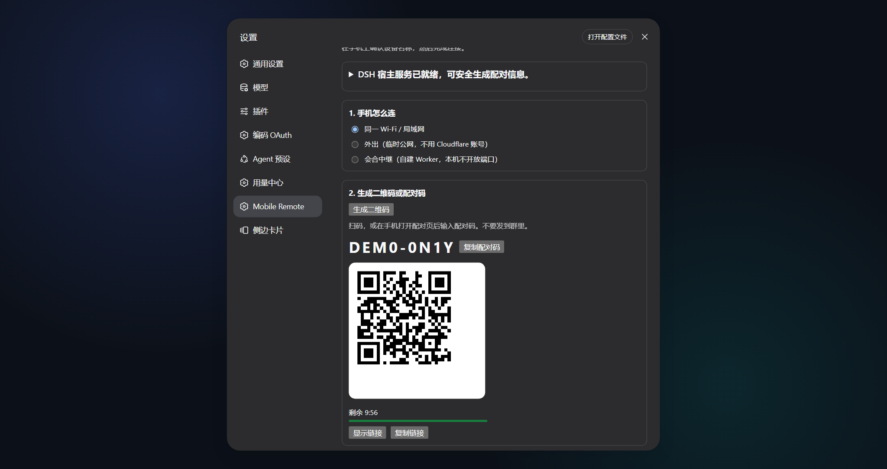
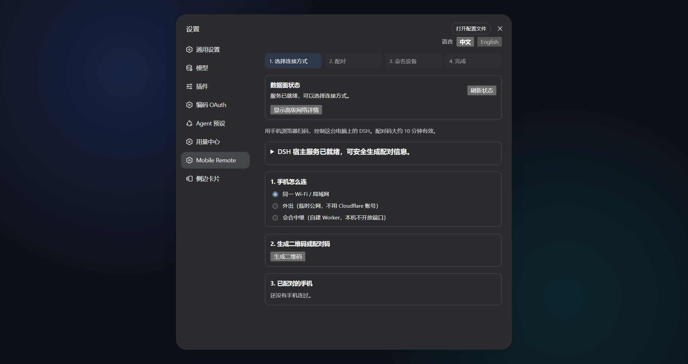
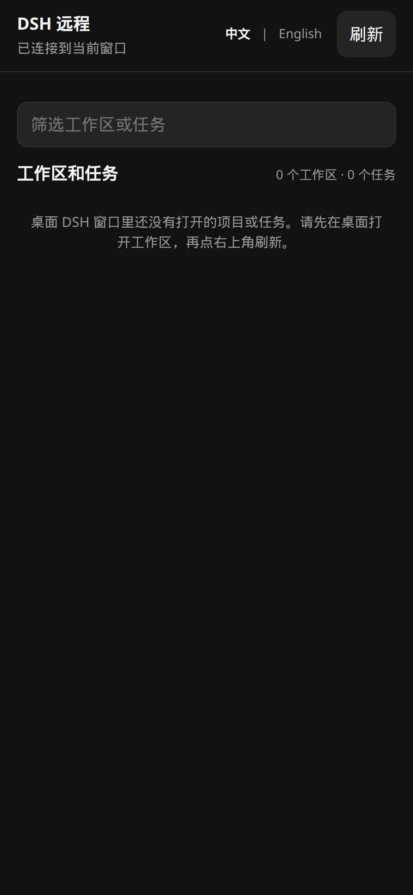
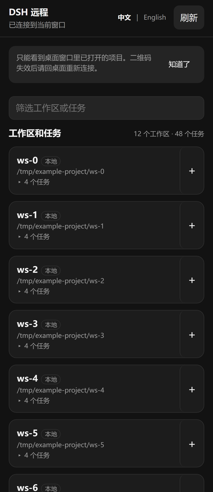

<!-- banner -->
<div align="center">

# dsh-coding-remote-kit

**v0.5.1** · DeepSeek Harness `0.1.0-rc.6` · GitHub `dsh-coding-remote-kit`

**面向 [DeepSeek Harness](https://github.com/deepseek-ai/dsh) 的远程手机访问插件。** 把手机配对到已经在跑 `dsh web` 的桌面，观察会话并做一组窄写操作——不必把完整 Web API 暴露出去。

[](https://www.npmjs.com/package/dsh-coding-remote-kit)
[](LICENSE)
[](CONTRIBUTING.md)

*[English](README.md) · [中文版](README.zh-CN.md) · [日本語](README.ja.md) · [한국어](README.ko.md) · [Português (BR)](README.pt-BR.md) · [Español](README.es.md) · [Français](README.fr.md) · [Deutsch](README.de.md) · [Русский](README.ru.md)*

</div>

---

> **升级：** 按 [`INSTALL.md`](INSTALL.md) 的版本化步骤操作。`0.5.1` 修复 Settings 安装 cloudflared 后无需重载即可 Start；`0.5.0` 增加连接诊断、Quick Tunnel 免责勾选与 cloudflared 钉死校验；保留 profile、存储与配对文件，所有选定插件更新后再重启一次现有 DSH Web 进程。`dsh-coding-oauth-core@0.1.0` 仍是 Hub/Subscription 的共享 npm 依赖，不是需要单独安装的 DSH 插件。

---

社区插件。**与 DeepSeek 无隶属关系，也不暗示官方背书。** 产品意图更接近 [Orca Mobile Companion](https://www.onorca.dev/docs/mobile)，而不是第二份桌面 IDE。

改这个仓库之前先读 [`AGENTS.md`](AGENTS.md)：**禁止自行重启生产 DSH Web 进程或其本机服务包装。** 只准备 tarball，由操作者通过测试机自己的进程管理器重启。

## 名称

最初 GitHub 仓库名是 `dsh-mobile-remote`。npm 上的 **`dsh-mobile-remote` 是另一个项目**（微信遥控插件）。本插件发布名为 `dsh-coding-remote-kit`。

| | 请用这个 | 说明 |
|---|---|---|
| npm | `dsh-coding-remote-kit@0.5.1` | `dsh plugin --profile web add dsh-coding-remote-kit@0.5.1` |
| GitHub | [`lninghaha/dsh-coding-remote-kit`](https://github.com/lninghaha/dsh-coding-remote-kit) | 旧 checkout 名 `dsh-mobile-remote` |
| Cordis 插件 id | `mobile-remote` | 不变 |
| 设置页 HTTP | `/api/mobile-remote/*` | 不变 |
| 存储 | `$DSH_HOME/storages/mobile-remote/` | 不变 |

**不要**执行 `dsh plugin add dsh-mobile-remote`——那会装到别人的微信插件。

## 状态

| 里程碑 | 状态 |
| --- | --- |
| 调研（Orca / DSH 生态） | 完成 — [`docs/research/`](docs/research/) |
| M1 插件骨架 + ADR / 威胁模型 | 完成 |
| M2 配对 / 局域网数据面 | 完成 |
| M3 窄 RPC / 审批 | 完成 |
| M4 签名 HTTPS / 原生 App | 未开始 |
| M5 自建会合中继 | 完成 — [`docs/05-cloud-relay.md`](docs/05-cloud-relay.md) |

## 特性

- **双语界面** — 桌面设置页与手机端支持中文 / English（`?lang=` 或应用内切换；默认跟随 `navigator.language`）。
- **一次配对** — 桌面展示二维码或 8 位 PIN；手机钉死桌面 X25519 公钥并持有 `deviceToken`（服务端只存 SHA-256）。
- **双平面** — 管理面留在回环 `dsh web`；移动数据面是独立端口（默认 `6879`）上的 RPC 白名单。
- **握手后 E2EE** — `/m/ws` 走 tweetnacl secretbox；未认证连接看不到会话内容。
- **窄写操作** — 观察会话、应答审批/提问、短回复；重编辑仍回桌面。
- **私网优先** — 推荐 LAN / Tailscale。可选 Cloudflare Quick Tunnel **只**暴露数据面，永不暴露 `3080`。可选自建会合中继：桌面与手机都出站，业务帧仍 E2EE。
- **标准插件形态** — 一个 Cordis 服务端插件 + classic-script 设置页。用 **file tarball** 做 `dsh plugin --profile web add`，不要 `link:` 工作树。

## 截图

<p align="center">
  
  &nbsp;
  
</p>
<p align="center"><em>桌面 设置 → 移动远程：生成配对 offer（左）· 通道状态与设备（右）</em></p>

<p align="center">
  
  &nbsp;&nbsp;
  
</p>
<p align="center"><em>手机端：输入 PIN / 扫码（左）· 配对后的会话列表（右）</em></p>

## 本插件解决的问题

| 你搜到 / 看到的 | 实际坏在哪 | 本插件怎么处理 |
|---|---|---|
| 「DSH 有没有 Orca 那种手机 companion」 | 官方没有一等公民的配对手机 App | 语义 companion：配对 + E2EE + 白名单 RPC |
| 手机上用 `dsh-pocket` / `dsh-web-remote` | 权限面 ≈ 完整 `dsh web` | 双平面；未知 RPC 一律 `forbidden` |
| 手机在蜂窝网、桌面在局域网 | 裸 LAN HTTP 页面可被 MITM | 优先 Tailscale；可选 Quick Tunnel（边缘 TLS，回源本机） |
| 插件 `import` 失败、3080 挂了 | DSH 会 fail-fast 整棵插件树 | 沙箱门禁 + tarball 拷到仓库外；禁止 `link:` |

## 快速开始

```bash
dsh plugin --profile web add dsh-coding-remote-kit@0.5.1
```

然后由**操作者**在自己的时间窗重启现有 DSH Web 进程。打开 **设置 → 移动远程**，生成配对 offer，手机扫码（或手输 PIN）。

源码 checkout（开发）：

```bash
pnpm test:sandbox
pnpm pack
mkdir -p "$HOME/.dsh/packages"
cp dsh-coding-remote-kit-0.5.1.tgz "$HOME/.dsh/packages/"
dsh plugin --profile web add "$HOME/.dsh/packages/dsh-coding-remote-kit-0.5.1.tgz"
```

不要对本工作树执行 `dsh plugin add ./`。pnpm 11 会把某些 `file:` tarball 解析成 `link:` 源码树，入口 import 失败会拖死整个 GUI。

## 目录

- [名称](#名称)
- [状态](#状态)
- [特性](#特性)
- [截图](#截图)
- [本插件解决的问题](#本插件解决的问题)
- [快速开始](#快速开始)
- [安装](#安装)
- [工作原理](#工作原理)
- [设置页](#设置页)
- [手机 RPC](#手机-rpc)
- [公网隧道](#公网隧道)
- [安全](#安全)
- [架构](#架构)
- [文档](#文档)
- [相关项目](#相关项目)
- [贡献](#贡献)
- [许可证](#许可证)

## 安装

需要 DeepSeek Harness `0.1.0-rc.6`（钉死）与 Node.js 22.19+。完整步骤、配对与隧道说明见 [INSTALL.md](INSTALL.md)。

开发：

```bash
pnpm install && pnpm build && pnpm test   # 在 Docker 沙箱里跑，不要在活着的 GUI 宿主机上跑
pnpm test:sandbox                         # Dockerfile 的 check / isolated-install / verify
```

构建产物：

- `lib/server/index.js` — Cordis 入口（`name` / `inject` / `Config` / `apply`）
- `lib/client.js` — 设置页 classic-script
- `lib/mobile/` — 数据面 `/m` 手机页

## 工作原理

```text
设置页（回环）                 手机浏览器
        │                            │
        │  二维码 / PIN  ────────────┤
        ▼                            ▼
 /api/mobile-remote/*          GET /m  +  WS /m/ws
   (dsh web, :3080)            （数据面, :6879, E2EE）
```

管理面留在宿主 Web 的回环围栏内。数据面是独立的 `node:http` + `ws`。配对广告 LAN 候选时可能把数据面从 `127.0.0.1` 再绑定到 `0.0.0.0`；若 Quick Tunnel 已在跑，则广告其 HTTPS origin，不再 widen。

## 设置页

打开 **设置 → 移动远程**：

- 状态（bind、端口、是否在听、活跃设备、隧道、会合中继）
- **局域网** / **Quick Tunnel** / **会合中继**
- 生成 offer → 二维码 + 8 位 PIN
- 设备列表与吊销
- 可选安装官方 `cloudflared`（禁止在插件 `apply()` 时自动跑）
- 连接诊断（脱敏网络候选、cloudflared 钉死校验、免责版本）
- Quick Tunnel 免责勾选（Start 前必选）

## 手机 RPC

白名单方法（其余一律 `forbidden`）：

`status.get` · `session.list` · `session.history` · `session.subscribe` · `session.unsubscribe` · `host.subscribe` · `session.prompt` · `session.cancel` · `session.create` · `respond` · `device.name`

推送包括会话事件以及带 `rpcId` 的 `approval.requested` / `question.requested`（供 `respond` 回显）。线格式见 [docs/03-protocol.md](docs/03-protocol.md)。

## 公网隧道

默认**关闭**。设置页须先勾选免责声明（请求体 `disclaimerAccepted: true`）再 Start。`cloudflared` Quick Tunnel **只**指向 `127.0.0.1:<数据面端口>`。`/m` 会在 `https://<随机>.trycloudflare.com` 上可达；配对仍需要 fragment 令牌（或 PIN）和 E2EE。插件 unload / 点「停止」时杀掉子进程。

禁止把 `3080` / `dsh web` 送进隧道。可选自建会合中继（桌面与手机都出站，业务仍 E2EE）：见 [docs/05-cloud-relay.md](docs/05-cloud-relay.md)。需要 Cloudflare Workers Paid，**不是**本项目运营的公共中继。

## 安全

不变量（完整模型：[docs/04-threat-model.md](docs/04-threat-model.md)）：

1. 未认证连接只处理握手。
2. `deviceToken` 只存 SHA-256；密钥与注册表文件权限 0600。
3. RPC 白名单默认拒绝；写操作审计到 `deviceId`。
4. 管理面：回环 + Host + CSRF。
5. 不削弱 `dsh web` `/api`，不抢 `api-proxy` provider。

**v0 诚实边界：** 裸 LAN 上 `/m` 的首次 HTTP 下发可被 MITM。优先走 overlay VPN。

禁止事项：

- 不共享他人凭据。
- 不监测未授权账户。
- 不把数据面端口裸绑 `0.0.0.0` 到公网（用户显式开启的 Quick Tunnel 除外）。
- 不暗示 DeepSeek 官方背书。

文档示例只用 `example.com`、`127.0.0.1`、`YOUR_TOKEN`。

## 架构

双平面、模块、存储与握手：[docs/02-architecture.md](docs/02-architecture.md) · [中文](docs/02-architecture.zh-CN.md)。

MVP 决策（路线 B）：[docs/01-mvp-scope.md](docs/01-mvp-scope.md)。

## 文档

| 文档 | 用途 |
|---|---|
| [INSTALL.md](INSTALL.md) | 安装、配对、隧道 |
| [CHANGELOG.md](CHANGELOG.md) | 发布历史 |
| [docs/00-project-rules.md](docs/00-project-rules.md) | 版本、公开 vs 本地、宿主 DSH 红线 |
| [docs/01-mvp-scope.md](docs/01-mvp-scope.md) | ADR：MVP 范围 |
| [docs/02-architecture.md](docs/02-architecture.md) | 内部架构 · [中文](docs/02-architecture.zh-CN.md) |
| [docs/03-protocol.md](docs/03-protocol.md) | RPC 白名单与推送信封 |
| [docs/04-threat-model.md](docs/04-threat-model.md) | 资产、攻击者、不变量 |
| [docs/05-cloud-relay.md](docs/05-cloud-relay.md) | 自建会合中继（M5） |
| [CONTRIBUTING.md](CONTRIBUTING.md) | 贡献指南 |
| [AGENTS.md](AGENTS.md) | Agent/操作者规则（禁止自行重启生产） |

## 相关项目

- [dsh-coding-subscription-oauth](https://github.com/lninghaha/dsh-coding-subscription-oauth) — 同作者的兄弟插件；本仓库文档布局参照它。
- GitHub：[`lninghaha/dsh-coding-remote-kit`](https://github.com/lninghaha/dsh-coding-remote-kit)。
- 本插件独立于用量中心插件 `dsh-hub-oauth-gateway`。
- 不替代官方 `@deepseek-ai/dsh`。

## 贡献

欢迎 issue 与 PR。Docker 沙箱、提交约定与文档分层见 [CONTRIBUTING.md](CONTRIBUTING.md)。

## 许可证

[MIT](LICENSE)。
